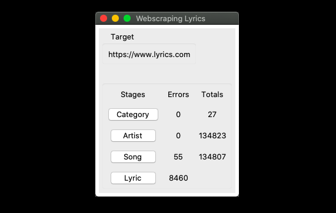

# Lyric Scraping
Scrapes lyrics from 'www.lyrics.com'

### Operation
_The times taken to complete a stage as shown below are when the program is running on a macbook air. 
HTTP requests rate is limited by the speed at which the program can process a single page. 
This is (roughly) one link per second. 
So far, this has been the easiest way to reduce (almost eliminate) errors due to overloading my home router._

### Steps
1. Start the program by typing `run` from the program's root dir.
2. Wait for the GUI to load
    * Performs dir and file checks.
    * Counts the completed files and errors to display counts in the GUI.

### Time to Complete
1. Click "Category" button
    * may take 20 seconds
2. Click "Artist" button
    * may take 3 minutes
3. Click "Song" button
    * may take a week
4. Click "Lyric" button
    * may take 2 months

### Notes
* You may notice that the sum of the song errors and song total don't equal the "Artist" stage total.
* This is because duplicates may exist during the "Song" scraping stage, but those clear out after the stage is finished.

### Known Bugs
* To get an updated count in the GUI, force the application closed and restart.
* `run` from `<programroot>/` doesn't work yet
* The math is off on the progress update in "scrapelyrics.py"
* Tkinter is not thread safe, so only one stage can be run at a time and the GUI is non-responsive until the stage finishes.

### To do:
* make message pop ups for stages that have no work to finish.

## Developer Notes
* Scraping is done in 4 stages;
    * category
    * artist
    * song
    * lyric
* Stages are completed sequentially.
* The next stage is intended to be started when the first stage is complete.
    * The next stage may be started manually if there is work to be started for that stage.
    * Only one stage may be running at a time (limits network stress and program complexity).
Using the GUI;
* Click on a button for any stage.
* The GUI is non-responsive while a stage is being scraped.
    * This is intentional as to not allow the user to start more processes.

Using the CLI;
* run 
    * `$ python3 webscrapergui.py` from `<programroot>/src/`
* or 
    * `$ run` from `<programroot>/`
